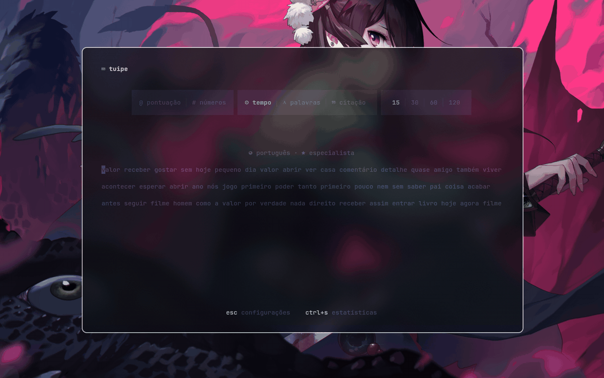
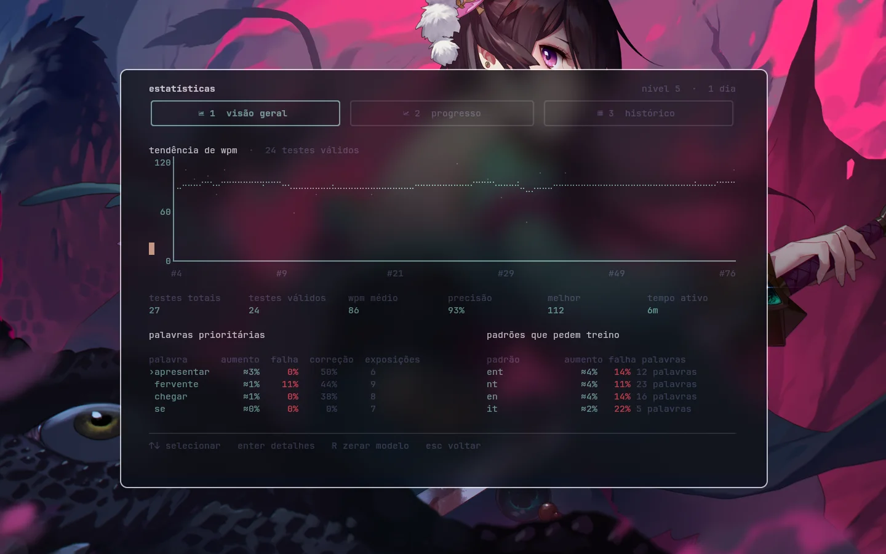
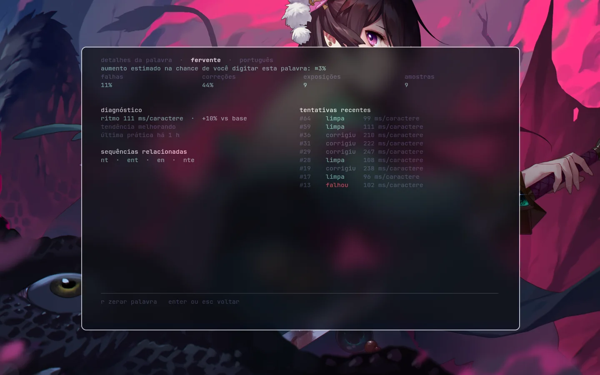
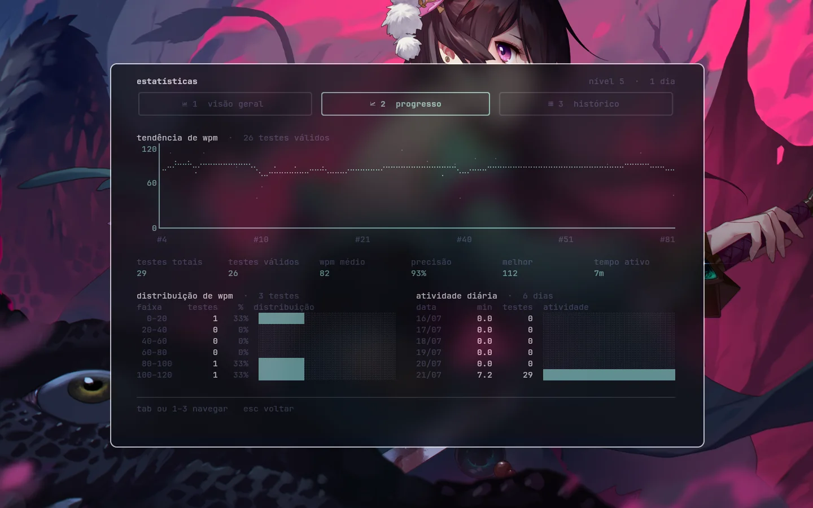
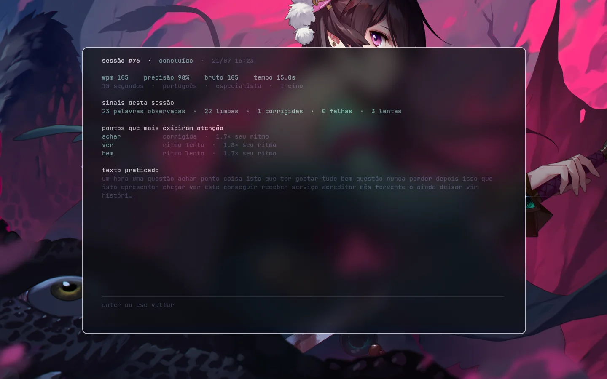

<h1 align="center">tuipe</h1>

<p align="center">
   O tuipe é um programa de treinamento de digitação inspirado no <a href="https://monkeytype.com/">Monkeytype</a> que roda inteiramente no terminal. É 100% local e não requer conta, servidor ou telemetria. O foco é treinar digitação, com estatísticas detalhadas e um modelo adaptativo que aprende com seus erros.
</p>

<p align="center">
  
</p>

## Treino adaptativo

Esse modo (ligado por padrão) é feito para que os testes foquem nas palavras que você mais precisa treinar.

Para isso, são analisados vários aspectos do seu desempenho:

- **Detecta palavras lentas:** uma palavra pode pedir treino mesmo quando você
  consegue corrigi-la antes de confirmar.
- **Detecta dificuldades em n-gramas:** se você erra `criança` e `França` em
  `nça`, o modelo reforça outras palavras com o mesmo padrão.
- **Correções também contam:** apagar uma letra pesa pouco; reconstruir quase
  toda a palavra e gastar vários segundos corrigindo pesa muito mais.
- **Identifica AFK:** o tempo detectado como ausência não entra no aprendizado.
- **Percebe quando você volta a acertar:** a frequência extra da palavra diminui
  gradualmente até níveis normais.

Todos esses sinais viram pesos em um único sorteio probabilístico. Palavras
difíceis aparecem mais, sem sessões especiais ou repetições agendadas.

Não existe uma regra impedindo repetições. Se uma palavra tiver 40% de chance de
aparecer em uma sessão, a chance de aparecer em duas seguidas é 16%:
`0,4 × 0,4`.

## O teste

Estão disponíveis testes por tempo, quantidade de palavras e citações, com:

- português e inglês;
- vocabulários comum, 1k e 5k;
- pontuação e números;
- modos normal, especialista e mestre;
   * modo normal: permite erros e correções
   * modo especialista: a primeira palavra errada encerra o teste (pode corrigir sem problema)
   * modo mestre: o primeiro caractere incorreto encerra o teste

## Estatísticas

Falhas nos modos especialista e mestre aparecem no histórico e continuam
alimentando o treino adaptativo. A curva de WPM usa apenas testes concluídos,
para não comparar uma sessão inteira com outra encerrada no primeiro erro.

<p align="center">
  
</p>

A mesma tela mostra o que está direcionando o treino adaptativo:

- palavras que estão recebendo prioridade;
- n-gramas que causam dificuldade em palavras diferentes;
- quantas vezes você falhou, corrigiu ou apagou parte de uma palavra.

Se `criança` aparece com `prioridade +2%`, ela tem 2% a mais de chance de ser
escolhida nos próximos testes.

Cada palavra pode ser aberta para ver as tentativas que formaram o diagnóstico.
Assim, é possível diferenciar uma falha isolada de uma palavra que exige
correções repetidas ou fica consistentemente lenta.

<p align="center">
  
</p>

A aba de progresso mostra a distribuição do seu WPM e quantos testes foram
feitos em cada dia.

<p align="center">
  
</p>

No histórico, qualquer sessão pode ser aberta para rever o texto digitado, o
resultado e as palavras que mais exigiram correção.

<p align="center">
  
</p>

## Configuração

Pressione `esc` para alterar modo, duração, dificuldade, idioma, vocabulário,
pontuação, números, treino e tema.

<p align="center">
  
</p>

## Instalação

Clone o repositório e execute pelo código fonte:

```sh
git clone https://github.com/MatheusNSantiago/tuipe.git
cd tuipe
cargo run --release
```

Requisitos:

- Linux x86-64;
- Rust 1.88 ou mais recente;
- terminal UTF-8 com pelo menos 50 colunas por 14 linhas;
- Nerd Font recomendada, mas não obrigatória.

Para instalar o comando `tuipe` no sistema:

```sh
cargo install --path . --locked
tuipe
```

## Controles principais

- `esc`: configurações;
- `ctrl+s`: estatísticas;
- `ctrl+w` ou `ctrl+backspace`: apagar a palavra atual;
- `ctrl+c`: cancelar o teste atual;
- `enter`: próximo teste;
- `r`: repetir o mesmo teste na tela de resultado;
- `q`: sair nas telas com esse controle visível.

Os controles disponíveis em cada tela aparecem no rodapé. Os atalhos também
podem ser alterados no `config.toml`.

## Base técnica

Algumas decisões do modelo vêm destes trabalhos:

- Dhakal et al., [Observations on Typing from 136 Million Keystrokes](https://userinterfaces.aalto.fi/136Mkeystrokes/resources/chi-18-analysis.pdf):
  intervalos entre teclas, bigramas, correções e sua relação com velocidade.
- Crump e Logan, [Hierarchical Control and Skilled Typing](https://www.crumplab.com/publications/Crump/files/4704/Crump%20and%20Logan%20-%202010%20-%20Hierarchical%20control%20and%20skilled%20typing%20Evidence%20.pdf):
  palavras e movimentos internos como partes diferentes da digitação.
- Soukoreff e MacKenzie, [Metrics for Text Entry Research](https://www.yorku.ca/mack/chi03.pdf):
  erros corrigidos e não corrigidos medidos separadamente.
- Van Waes et al., [Modelling Typing Disfluencies as a Finite Mixture Process](https://link.springer.com/article/10.1007/s11145-021-10203-z):
  pausas separadas do ritmo fluente.
- Mettler, Massey e Kellman, [A Comparison of Adaptive and Fixed Schedules of Practice](https://pubmed.ncbi.nlm.nih.gov/27123574/):
  prática adaptativa comparada a uma sequência fixa.

## Créditos

O tuipe é um projeto independente inspirado no
[Monkeytype](https://monkeytype.com/). A origem e a licença dos conteúdos
importados estão registradas em [NOTICE](NOTICE).

## Licença

[GPL-3.0-only](LICENSE)
